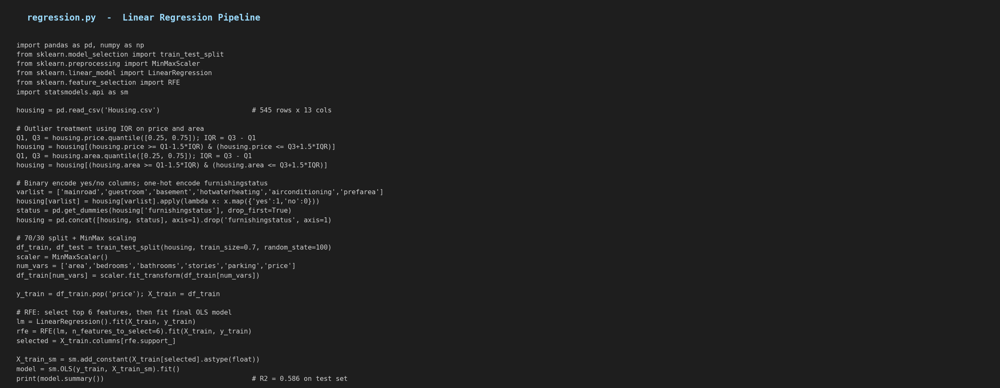
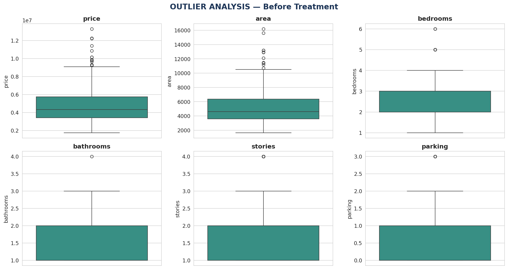
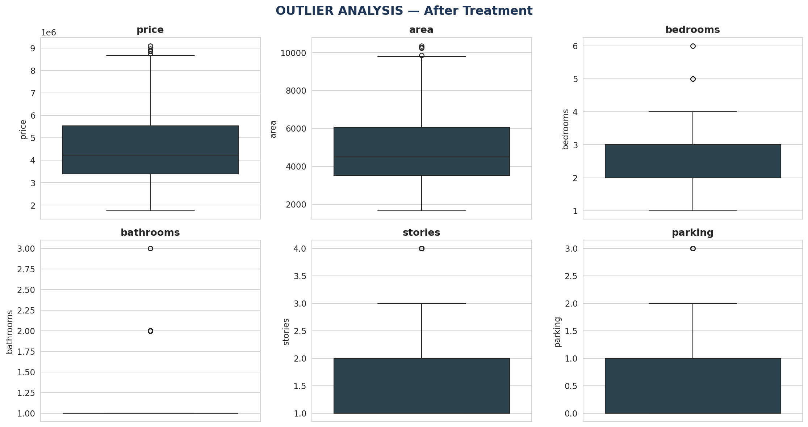
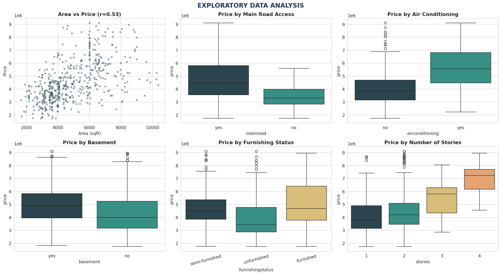
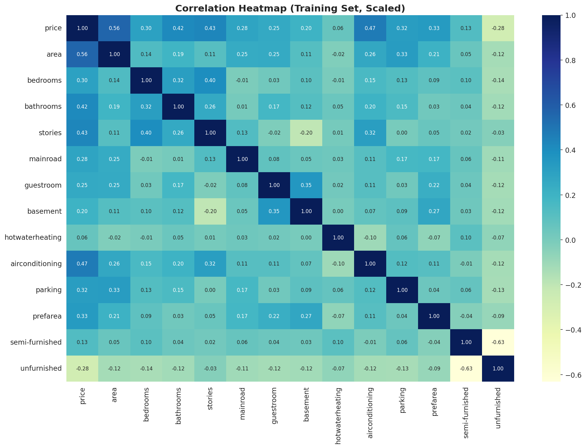
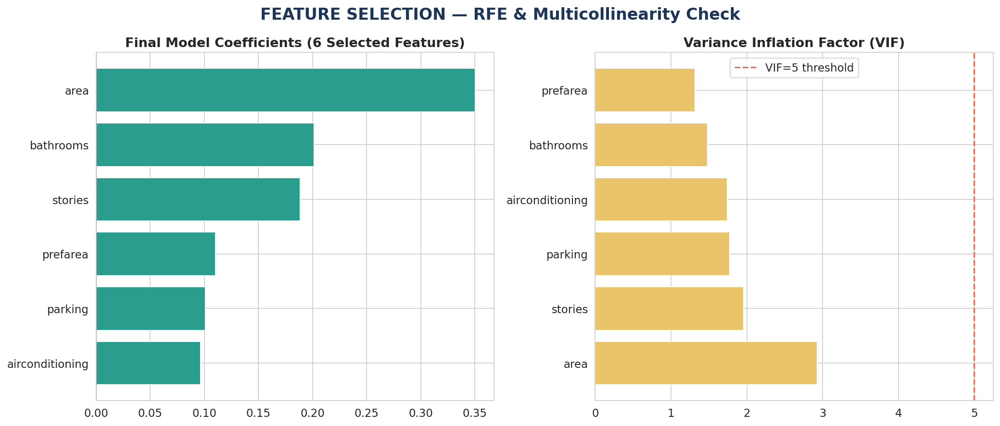
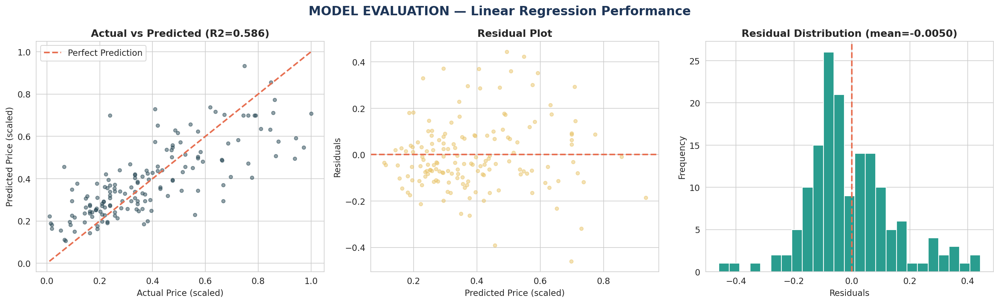

# Predicting House Prices with Linear Regression
### Project 1 Proposal — Level 2 | Data Analytics



> **Dataset:** Housing Price Dataset (Delhi region real estate)
> **Records:** 545 properties, 13 features
> **Tools:** Python, Pandas, NumPy, Matplotlib, Seaborn, Scikit-learn, Statsmodels

---

## Table of Contents
1. [Problem Statement](#1-problem-statement)
2. [Dataset Description](#2-dataset-description)
3. [Data Inspection & Cleaning](#3-data-inspection--cleaning)
4. [Outlier Treatment](#4-outlier-treatment)
5. [Exploratory Data Analysis](#5-exploratory-data-analysis)
6. [Data Preparation](#6-data-preparation)
7. [Feature Selection](#7-feature-selection)
8. [Model Building](#8-model-building)
9. [Model Evaluation](#9-model-evaluation)
10. [Results & Interpretation](#10-results--interpretation)
11. [How to Reproduce](#11-how-to-reproduce)

---

## 1. Problem Statement

A real estate company wants to understand which property characteristics drive sale price in the Delhi housing market, and use that understanding to estimate prices for new listings. This project builds a multiple linear regression model that predicts house price from structural features (area, bedrooms, bathrooms, stories) and amenity features (air conditioning, parking, preferred area, furnishing status).

**Objectives:**
- Identify which variables significantly affect house price
- Build an interpretable linear model with minimal multicollinearity
- Evaluate model performance on unseen data

---

## 2. Dataset Description

| Feature | Type | Description |
|---|---|---|
| `price` | Numeric (target) | Sale price of the house |
| `area` | Numeric | Plot area in square feet |
| `bedrooms` | Numeric | Number of bedrooms |
| `bathrooms` | Numeric | Number of bathrooms |
| `stories` | Numeric | Number of stories |
| `mainroad` | Categorical | Connected to main road (yes/no) |
| `guestroom` | Categorical | Has a guest room (yes/no) |
| `basement` | Categorical | Has a basement (yes/no) |
| `hotwaterheating` | Categorical | Has hot water heating (yes/no) |
| `airconditioning` | Categorical | Has air conditioning (yes/no) |
| `parking` | Numeric | Number of parking spaces |
| `prefarea` | Categorical | Located in a preferred area (yes/no) |
| `furnishingstatus` | Categorical | Furnished / Semi-furnished / Unfurnished |

---

## 3. Data Inspection & Cleaning

```python
housing = pd.read_csv('Housing.csv')
housing.shape          # (545, 13)
housing.isnull().sum() # all zero — no missing values
```

The dataset has no missing values, so no imputation is required. All numeric columns are correctly typed (`int64`), and categorical columns are stored as `yes/no` strings or multi-level text.

---

## 4. Outlier Treatment



`price` and `area` show visible outliers in the boxplots. The IQR method was applied to both columns:

```python
Q1 = housing.price.quantile(0.25)
Q3 = housing.price.quantile(0.75)
IQR = Q3 - Q1
housing = housing[(housing.price >= Q1 - 1.5*IQR) & (housing.price <= Q3 + 1.5*IQR)]
# repeated for 'area'
```

| Step | Rows Removed | Remaining Rows |
|---|---|---|
| Price outliers | 15 | 530 |
| Area outliers | 13 | 517 |



After treatment, both `price` and `area` distributions are noticeably tighter with far fewer extreme points.

---

## 5. Exploratory Data Analysis



**Observations:**
- `area` has the strongest visible relationship with `price` among the numeric features
- Houses on the main road command a price premium
- Air conditioning and basement are both associated with higher median prices
- Furnished homes are priced higher on average than semi-furnished or unfurnished homes
- Price increases steadily with number of stories

---

## 6. Data Preparation

### Binary Encoding
The `yes/no` categorical columns were mapped to `1/0`:

```python
varlist = ['mainroad','guestroom','basement','hotwaterheating','airconditioning','prefarea']
housing[varlist] = housing[varlist].apply(lambda x: x.map({'yes': 1, 'no': 0}))
```

### Dummy Variables
`furnishingstatus` has three levels, so it was converted into two dummy columns (dropping the first to avoid the dummy variable trap):

```python
status = pd.get_dummies(housing['furnishingstatus'], drop_first=True)
housing = pd.concat([housing, status], axis=1)
housing.drop(['furnishingstatus'], axis=1, inplace=True)
```

### Train-Test Split & Scaling
A 70/30 train-test split was used. `MinMaxScaler` was applied to numeric columns so all features sit on a comparable 0–1 scale for stable regression coefficients:

```python
df_train, df_test = train_test_split(housing, train_size=0.7, random_state=100)
scaler = MinMaxScaler()
num_vars = ['area','bedrooms','bathrooms','stories','parking','price']
df_train[num_vars] = scaler.fit_transform(df_train[num_vars])
```

### Correlation Heatmap



`area`, `bathrooms`, and `stories` show the strongest correlation with `price` among the engineered feature set.

---

## 7. Feature Selection

Recursive Feature Elimination (RFE) was used with a `LinearRegression` estimator to select the 6 most predictive features out of the full feature set:

```python
lm = LinearRegression()
lm.fit(X_train, y_train)
rfe = RFE(lm, n_features_to_select=6)
rfe.fit(X_train, y_train)
selected_cols = X_train.columns[rfe.support_]
```

**Selected features:** `area`, `bathrooms`, `stories`, `airconditioning`, `parking`, `prefarea`

### Multicollinearity Check (VIF)



| Feature | VIF |
|---|---|
| area | 2.93 |
| stories | 1.96 |
| parking | 1.77 |
| airconditioning | 1.74 |
| bathrooms | 1.48 |
| prefarea | 1.32 |

All VIF values are well below the common threshold of 5, confirming there is no significant multicollinearity among the selected features.

---

## 8. Model Building

A final OLS regression model was fit on the 6 selected features:

```python
X_train_sm = sm.add_constant(X_train[selected_cols].astype(float))
model = sm.OLS(y_train, X_train_sm).fit()
print(model.summary())
```

### Model Summary

| Metric | Value |
|---|---|
| R-squared (train) | 0.611 |
| Adjusted R-squared (train) | 0.605 |
| F-statistic | 92.83 |
| Prob (F-statistic) | 1.31e-69 |

### Coefficients

| Feature | Coefficient | p-value |
|---|---|---|
| const | 0.1097 | < 0.001 |
| area | 0.3502 | < 0.001 |
| bathrooms | 0.2012 | < 0.001 |
| stories | 0.1884 | < 0.001 |
| airconditioning | 0.0965 | < 0.001 |
| parking | 0.1009 | < 0.001 |
| prefarea | 0.1102 | < 0.001 |

All six selected features are statistically significant at the 0.1% level.

---

## 9. Model Evaluation

The trained model was evaluated against the held-out 30% test set.



| Metric | Test Set |
|---|---|
| R-squared | 0.586 |
| RMSE | 0.150 |
| MAE | 0.115 |

The actual-vs-predicted plot shows points clustered reasonably close to the diagonal line of perfect prediction. The residual plot shows no strong funnel pattern, and the residual distribution is roughly centered around zero, indicating the linear model fits reasonably well without severe heteroscedasticity.

---

## 10. Results & Interpretation

- **Area is the strongest single driver of price** (coefficient 0.350) — larger plots command meaningfully higher prices, holding other features constant
- **Bathrooms and stories** are the next most influential structural features
- **Air conditioning, parking, and preferred-area location** each add a smaller but statistically significant price premium
- The model explains roughly **59% of the variance** in house prices on unseen data (test R² = 0.586), which is a reasonable result for a linear model on a relatively small, real-world dataset with inherent price noise
- VIF values confirm the selected features are not redundant with one another, so each coefficient can be interpreted somewhat independently

### Limitations
- A purely linear model cannot capture non-linear interactions between features (e.g., the effect of area may differ by furnishing status)
- The dataset is relatively small (545 rows before cleaning), which limits how much signal a linear model can extract
- Regional price dynamics specific to Delhi may not generalise to other housing markets

---

## 11. How to Reproduce

```bash
pip install pandas numpy matplotlib seaborn scikit-learn statsmodels
python regression.py
```

### Requirements

```
pandas>=1.5.0
numpy>=1.23.0
matplotlib>=3.6.0
seaborn>=0.12.0
scikit-learn>=1.1.0
statsmodels>=0.13.0
```

### Repository Structure

```
housing-price-prediction/
|-- README.md                     <- This report
|-- regression.py                 <- Full regression pipeline
|-- Housing.csv                   <- Raw dataset (545 rows)
|-- Housing_clean.csv             <- Dataset after outlier removal and encoding
|-- figA_outliers_before.png      <- Boxplots before outlier treatment
|-- figA2_outliers_after.png      <- Boxplots after outlier treatment
|-- figB_eda.png                  <- Exploratory data analysis charts
|-- figC_correlation.png          <- Correlation heatmap
|-- figD_features.png             <- RFE coefficients and VIF
|-- figE_evaluation.png           <- Actual vs predicted, residual plots
|-- figF_code.png                 <- Pipeline code summary
|-- requirements.txt
```
